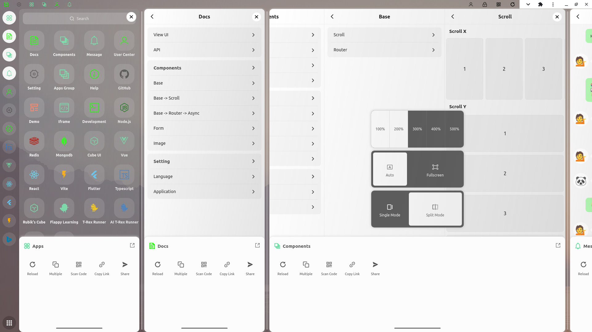

English | [简体中文](./README-ZH.md)

# View UI

Lightweight cross-end, responsive micro-application development platform, through the unified use of mobile interaction logic in all terminal devices, to achieve a consistent design, development and use experience of multiple ends.

Using the current mainstream traditional vertical screen cell phones as the basis for adaptation, and through window cascading, tiling, telescoping and other typesetting methods to achieve a wide range of adaptations for folding screens, pads, PCs, headsets and other terminal devices.

> The project is in the early experimental and exploratory stage, some functions are not yet stable and perfect, only for preview, not open source for now.

## Features

- Support multi-application split-screen display, by creating virtual partitions in the window to display multiple applications at the same time, which can give full play to the display advantages of widescreen.

- Widescreen mode, the application window supports elastic scaling and gesture switching, maximizing the use of the free viewing area in the widescreen.

- support multi-application layered display, applications can be freely mounted between the main application layer (fixed full-screen), sub-application layers (floating, elastic split-screen) or custom layers.

- using inheritable dynamic application registry, inheritance can reduce duplicate configuration items, and dynamic registry can avoid the need to recompile after each configuration modification.

- support for dynamic registration and sub-package release of applications, which can directly and dynamically access unregistered applications via file paths without pre-defined routing.

- support for differential rendering of different terminal environments, with optional homogeneous or heterogeneous pattern matching to achieve localized differential adaptation.

- Support mouse gestures to maintain a consistent user experience across multiple terminals and avoid unnecessary learning and adaptation costs.

- Support cross IFrame gesture operations to maintain the consistency of overall interaction behavior (not valid across domains).

- Event-based cross-application data bus to realize data flow between multiple applications and reduce system coupling (mainly for independently packaged applications).

- Can be used with conventional layout applications or websites to extend new interactive interfaces without destroying the main layout of the original project.

- for different application scenarios, the sub-application supports three types of layout: left, right floating and fixed to the right.

- Built on Vite, TS, the main application is developed using Vue 3, and the sub-application is loaded as a Vue component by default.

- support for React, Solid and other frameworks to develop sub-applications (only provide DOM nodes for custom mounts).

- support for partially responsive layout of pages as a transition solution before the CSS @container feature is widely compatible.

- the platform as a whole consists of three parts: application base, micro-application and public dependencies, all three of which can be built and released independently.

- Isolation of public components and routing among different sub-applications, with each sub-application having independent Router and Navigator instances.

- Built-in simple and lightweight sub-application isolation scheme, supporting ES Component, Shadow DOM, IFrame three options.

- Integrated PWA offline cache, installable to the desktop.

## What are the problems with traditional multi-terminal responsive layouts?

In a traditional CSS @media screen based multi-end responsive layout, one of the PC or mobile endpoints is usually chosen as the primary adaptation target, while other secondary endpoints are often chosen as a compromise, making it technically difficult to achieve a true multi-endpoint balance.

Although the traditional responsive layout can also achieve highly differentiated interaction, it is often accompanied by strong coupling of code and a large amount of redundant code, resulting in a situation where the code of multiple ends is entangled with each other, and as the system differentiation and complexity continue to increase, it will eventually produce code that is difficult to maintain.

In the actual application cases, the traditional responsive layout is mainly used in some relatively simple cross-platform differentiated layout and interaction scenarios, and there are still obvious limitations in the face of complex scenarios.

## How can View UI solve the problem of multi-end adaptation?

View UI tries to solve the above problem by developing a common virtual window with unified standard for multi-end environment (using virtual screens with the same minimum size and interaction logic) and using no or less differentiated code to maintain the overall consistency and reliability of application behavior, which reduce the amount of application layer code while also reducing the complexity of the system.

Second, it is to unify the differences in interaction behaviors that exist between different input devices. The consistent screen size needs to match the consistent input behavior to produce a consistent experience across ends. View UI provides the Pointer module as a unified input event proxy layer to smooth out the behavioral differences between different types of pointer devices such as mouse and touch screen.

Although this project is based on WEB platform, the idea of multi-end adaptation is not limited to WEB environment, so it is also applicable to developers of other application platforms.

## Public Dependency Libraries

> All api's are imported as npm modules and can be extended as needed.

### vue

The original npm module for vue

### components

Public base component repository

### helper

Public tool functions

### network

Network services, based on axios wrapper

### state

Global responsive state management

### navigator

Global navigation-related properties, methods

## routing

View UI uses a custom lightweight, flat, dynamic routing scheme (since the official Vue routing did not match the many application scenarios and requirements in this project, custom routing was the more logical choice).

### Dynamic parameter handling
